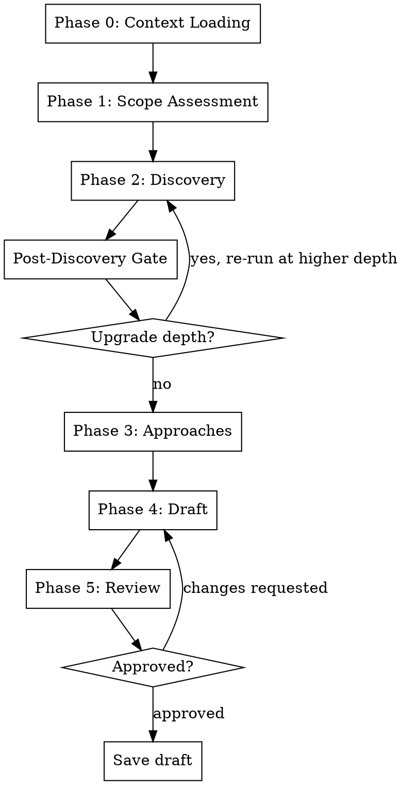

I'm using the sdlc:define skill to define/reshape an SDLC artifact.

**NO DRAFT WITHOUT ALL FIVE PHASES**

<HARD-GATE>
Do NOT produce a draft without completing Context Loading, Scope Assessment, Discovery, Approaches, and Draft phases in order. Do NOT skip a phase because the artifact "seems simple."
</HARD-GATE>

## Process Flow



---

This skill has 5 mandatory phases plus a post-discovery gate. ALL phases run every time. Depth varies (LIGHT / STANDARD / DEEP) but phases are NEVER skipped.

---

## Red Flags (anti-rationalization)

Before starting, internalize these. Check back if you feel tempted to shortcut.

| Thought | Reality |
|---------|---------|
| "This is simple, skip to the draft" | All 5 phases are mandatory. Simple tasks go through LIGHT depth, not skipped phases. |
| "I already know what to build" | Phase 2 Discovery catches assumptions. Even if you're right, the user confirms. |
| "The reference guide isn't needed" | The reference guide has the scope criteria and draft template. Always load it. |
| "Let me skip the approaches phase" | LIGHT gets a single approach confirmation. It takes 10 seconds. Don't skip it. |
| "The draft is obvious, no review needed" | Phase 5 Review is where the user catches issues before anything goes to GitHub. Always present it. |
| "This reshape is minor, no Changes section" | The Changes section is how sdlc:update knows what to modify. Always include it for reshapes. |
| "I'll assess scope from intuition" | Scope criteria are objective and concrete in the reference guide. Use those signals, not vibes. |
| "One more question won't hurt" | LIGHT gets 0-1 questions. STANDARD gets 2-4. Respect the depth ceiling. |

---

## Phase 0: Context Loading (mandatory)

### 0a. Parse Level

Extract the artifact level from `$ARGUMENTS`. Valid levels: `prd`, `pi`, `epic`, `feature`, `story`.

- If `$ARGUMENTS` contains a level keyword, use it.
- If `$ARGUMENTS` also contains an issue number (e.g., `story #45`), note it — this is a reshape of an existing artifact.
- If no level is provided, ask: **"What are we defining? (prd, pi, epic, feature, story)"** and STOP until the user answers.

### 0b. Load Reference Guide

```
Read ${CLAUDE_PLUGIN_ROOT}/skills/define/reference/<level>-guide.md
```

This file contains:
- **Scope assessment criteria** (concrete signals for LIGHT / STANDARD / DEEP)
- **Question templates** for discovery
- **Draft body template** (level-specific sections and frontmatter)
- **Greenfield/brownfield guidance** (PRD level only)

If the file does not exist or fails to load, STOP and tell the user: "The reference guide for `<level>` is missing. Cannot proceed without it."

### 0c. Read Upstream Artifacts

Load context based on the artifact level:

| Level | Read These |
|-------|-----------|
| `prd` | Scan codebase: check if `.claude/sdlc/prd/PRD.md` exists (greenfield vs brownfield detection). If brownfield, scan `package.json`, `pyproject.toml`, directory structure for existing tech stack. |
| `pi` | `.claude/sdlc/prd/PRD.md` (focus on Roadmap section). Check for previous PI retros in `.claude/sdlc/retros/`. |
| `epic` | `.claude/sdlc/pi/PI.md` + `.claude/sdlc/prd/PRD.md` |
| `feature` | Parent epic issue via `gh issue view <number> --json title,body,labels` + `.claude/sdlc/pi/PI.md` + `.claude/sdlc/prd/PRD.md` |
| `story` | Parent feature via `gh issue view` + parent epic via `gh issue view` + `.claude/sdlc/prd/PRD.md` (security constraints, data models, API contracts) |

For `feature` and `story`: if the parent issue number is not in `$ARGUMENTS`, ask: **"Which parent [epic/feature] is this under? (issue number)"**

### 0d. Detect New vs Reshape

**Reshape** if any of:
- User provided an existing issue number in `$ARGUMENTS`
- User explicitly says "reshape", "rethink", "revise", or "update"

**Draft exists check:** Also scan for existing drafts at `.claude/sdlc/drafts/<level>-*.md`.
- If a draft exists AND the user provided an issue number that matches the draft filename → this is a reshape, load the draft.
- If a draft exists but no issue number was provided → ask before assuming:

> "I found a draft `<filename>`. Is this related to what you're defining now, or do you want to start fresh?"

If start fresh, proceed with new artifact flow (ignore the existing draft). If related, proceed with reshape flow.

If reshaping:
- Load the current state of the artifact (from GitHub issue body or git file)
- This becomes the starting context for all subsequent phases
- The draft produced in Phase 4 will include a `## Changes` section

If new:
- Proceed normally — no existing state to load

---

## Phase 1: Scope Assessment (mandatory)

Use the **objective criteria** from the reference guide loaded in Phase 0b. The reference guide contains concrete signals per level (e.g., file count, area count, dependency count, pattern novelty).

Evaluate the artifact against those criteria and announce the result visibly:

> **"This looks like a STANDARD scope — it spans 2 areas (auth, api) and extends existing patterns with some new ground."**

The assessment MUST reference specific signals from the criteria, not subjective judgment.

**Output:** One of `LIGHT`, `STANDARD`, or `DEEP`

Store this as `current_depth` for use in subsequent phases.

---

## Phase 2: Discovery (mandatory, depth varies)

Ask questions ONE AT A TIME. Wait for the user's answer before asking the next question. The reference guide contains question templates — adapt them to the specific context.

### LIGHT (0-1 follow-up questions)

Summarize what you understand from the upstream context:

> "Based on the [PI Plan / parent epic / PRD], here's what I understand about this [level]: [summary]. Does this match your intent?"

If the user confirms, move on. If they correct something, ask at most ONE follow-up question.

### STANDARD (2-4 targeted questions)

Ask 2-4 questions, one at a time, drawn from the reference guide's question templates and tailored to this specific artifact.

For codebase exploration needs: dispatch a research subagent.

```
Use Agent tool to explore the codebase for [specific question].
Prompt: "Search for [pattern/file/usage] and report what you find. Do not modify any files."
```

Incorporate the subagent's findings before asking the user.

### DEEP (4+ questions, research-first)

Before asking the user anything:
1. Dispatch research subagents to explore unknowns in the codebase
2. Analyze findings
3. Then ask informed questions (4+), one at a time

Research subagent dispatch pattern:

```
Use Agent tool for deep codebase analysis.
Prompt: "Investigate [specific area]. Search for: [patterns, files, dependencies, existing implementations].
Report: what exists, what patterns are used, what gaps you found. Do not modify any files."
```

---

## Post-Discovery Gate: Re-evaluate Scope (mandatory)

After Phase 2 completes, re-evaluate the depth using the **same objective criteria** from the reference guide.

Discovery may have revealed:
- More areas affected than initially apparent
- Hidden dependencies
- Architectural complexity not visible from the parent context
- Cross-cutting concerns

### Rules

1. **Depth can only go UP** (LIGHT -> STANDARD, STANDARD -> DEEP), never down.
2. **Maximum one upgrade per session.**
3. If upgrading, announce it clearly:

> **"Discovery revealed [specific new information]. Upgrading from LIGHT to STANDARD."**

4. After upgrading: **re-run Phase 2** at the new depth level. This means asking the additional questions that the higher depth requires. Do NOT re-ask questions already answered.
5. If no upgrade needed: proceed to Phase 3.

---

## Phase 3: Approaches (mandatory, depth varies)

Based on everything learned in Phase 0-2, present implementation approaches.

### LIGHT

> "I'd approach it this way: [single approach with brief rationale]. Sound right?"

Wait for user confirmation. If they disagree, discuss briefly and converge.

### STANDARD

> "Two options:
> - **Option A:** [approach] — [pro/con]
> - **Option B:** [approach] — [pro/con]
>
> I'd recommend **A** because [reason]."

Let the user pick or propose a hybrid.

### DEEP

> "Three approaches with trade-offs:
>
> | Approach | Pros | Cons | Effort |
> |----------|------|------|--------|
> | A: [name] | ... | ... | ... |
> | B: [name] | ... | ... | ... |
> | C: [name] | ... | ... | ... |
>
> My recommendation: [approach] because [reasoning that references the discovery findings]."

Discuss until the user commits to an approach.

---

## Phase 4: Draft (mandatory)

Produce a draft file based on the chosen approach and all discovery context.

### Draft Location

```
.claude/sdlc/drafts/<level>-<name-or-number>.md
```

Name convention:
- New artifacts: `<level>-<kebab-case-name>.md` (e.g., `epic-auth-setup.md`, `story-token-encryption.md`)
- Reshapes: `<level>-<issue-number>.md` (e.g., `story-45.md`)

### Draft Frontmatter

Every draft MUST start with this YAML frontmatter:

```yaml
---
type: <level>
name: <artifact name>
priority: <critical|high|medium|low>
areas: [<area-label-1>, <area-label-2>]
status: draft
parent-epic: <issue number, if applicable>
parent-feature: <issue number, if applicable>
---
```

- `parent-epic` and `parent-feature` are only included when relevant to the level.
- `areas` uses the area labels defined in the PRD's Label Taxonomy section. If defining a PRD (no existing PRD to read from), the areas are part of what you're creating — derive them from codebase analysis or user description.

### Draft Body

The body format is defined in the reference guide for the specific level. Use the template from the guide, filling in content from the discovery and approach phases.

All drafts include fields that `sdlc:create` (for new artifacts) or `sdlc:update` (for reshapes) will need to execute. Do not leave placeholder fields empty — if a field cannot be determined, note it with `[TBD: reason]` so the downstream skill can flag it.

### Reshape Drafts: Changes Section

If this is a reshape of an existing artifact, the draft MUST include a `## Changes` section at the end that documents exactly what was modified:

```markdown
## Changes

Summary: [one-line description of what changed and why]

| Section | Change | Old Value | New Value |
|---------|--------|-----------|-----------|
| Priority | Updated | medium | high |
| Acceptance Criteria | Added | — | New AC #4: "Should handle..." |
| Dependencies | Added blocker | — | Blocked by #52 |
| Description | Rewritten | [first 50 chars of old]... | [first 50 chars of new]... |
```

This section is consumed by `sdlc:update` to apply surgical edits. It MUST be present for all reshapes, even minor ones.

### Write the Draft

```
Write the draft to .claude/sdlc/drafts/<filename>.md
```

Ensure the `.claude/sdlc/drafts/` directory exists before writing. Create it if needed:

```bash
mkdir -p .claude/sdlc/drafts
```

---

## Phase 5: Review (mandatory)

Present the full draft to the user. Do not summarize — show the entire content so the user can review every field.

Then ask:

> **"Want to change anything?"**

### Review Loop

- If the user requests changes: apply them to the draft, present the updated version, and ask again.
- Loop until the user explicitly approves (says "looks good", "approved", "ship it", "done", etc.).
- Do NOT interpret silence or ambiguity as approval. If unclear, ask: **"Is this approved, or do you want more changes?"**

### On Approval

**For a NEW artifact:**

> "Draft saved to `.claude/sdlc/drafts/<filename>`. Run `/sdlc:create <level>` when ready to push it live."

**For a RESHAPE:**

> "Draft saved with changes documented. Run `/sdlc:update <level> <number>` to apply the changes."

---

## Dependency Format (canonical)

All dependency references in issue bodies use this exact format:

```
- Blocked by: #N, #M
- Blocks: #N, #M
```

Rules:
- Always dash-prefixed (`- Blocked by:` not `Blocked by:`)
- Issue numbers use `#` prefix: `#48`, not `48`
- Multiple blockers separated by comma-space: `#48, #52`
- When no dependencies: `- Blocked by: none` and `- Blocks: none`
- Never use brackets, quotes, or other formatting around issue numbers

This is the canonical format that all define, create, update, and reconcile skills expect.

---

## Integration

This skill is the **brainstorming half** of a two-part flow:

| Scenario | Flow |
|----------|------|
| New artifact | `sdlc:define` produces a draft -> `sdlc:create` pushes it to GitHub/git |
| Reshape existing artifact | `sdlc:define` (loads current state, produces draft with Changes section) -> `sdlc:update` applies surgical edits |

The draft file is the handoff mechanism. It contains everything the downstream skill needs to execute without asking creative questions.

---

## Phase Checklist

Before finishing, verify ALL phases were completed:

- [ ] Phase 0: Context loaded (reference guide + upstream artifacts)
- [ ] Phase 1: Scope assessed with objective criteria (LIGHT/STANDARD/DEEP announced)
- [ ] Phase 2: Discovery questions asked (count matches depth)
- [ ] Post-Discovery Gate: Scope re-evaluated (upgrade if warranted)
- [ ] Phase 3: Approach(es) presented and user chose one
- [ ] Phase 4: Draft written to `.claude/sdlc/drafts/`
- [ ] Phase 5: Draft reviewed and approved by user

If any phase was skipped, GO BACK and complete it now.
