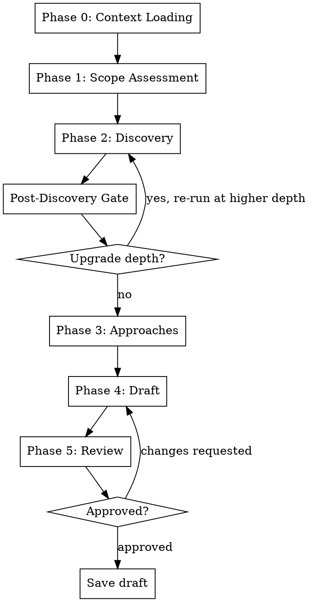
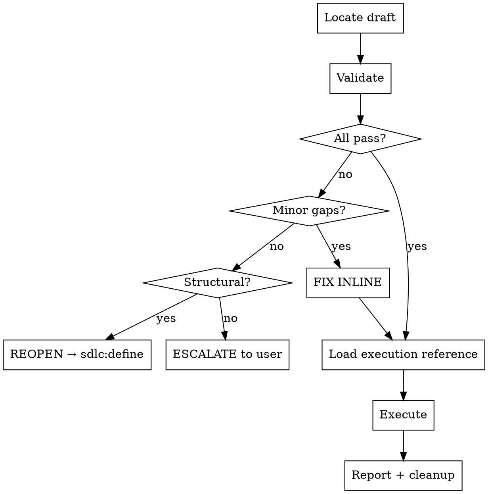
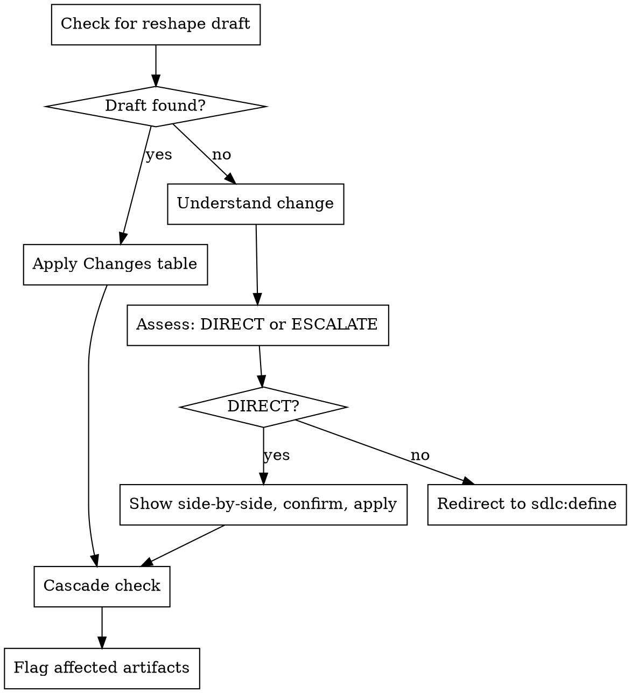
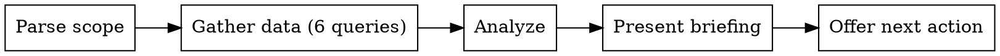
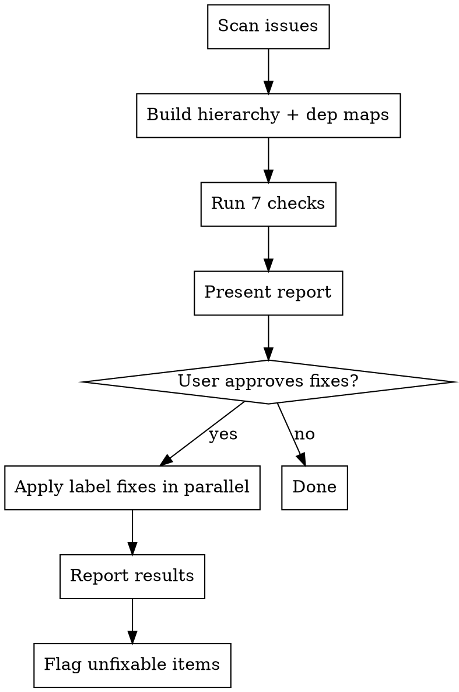
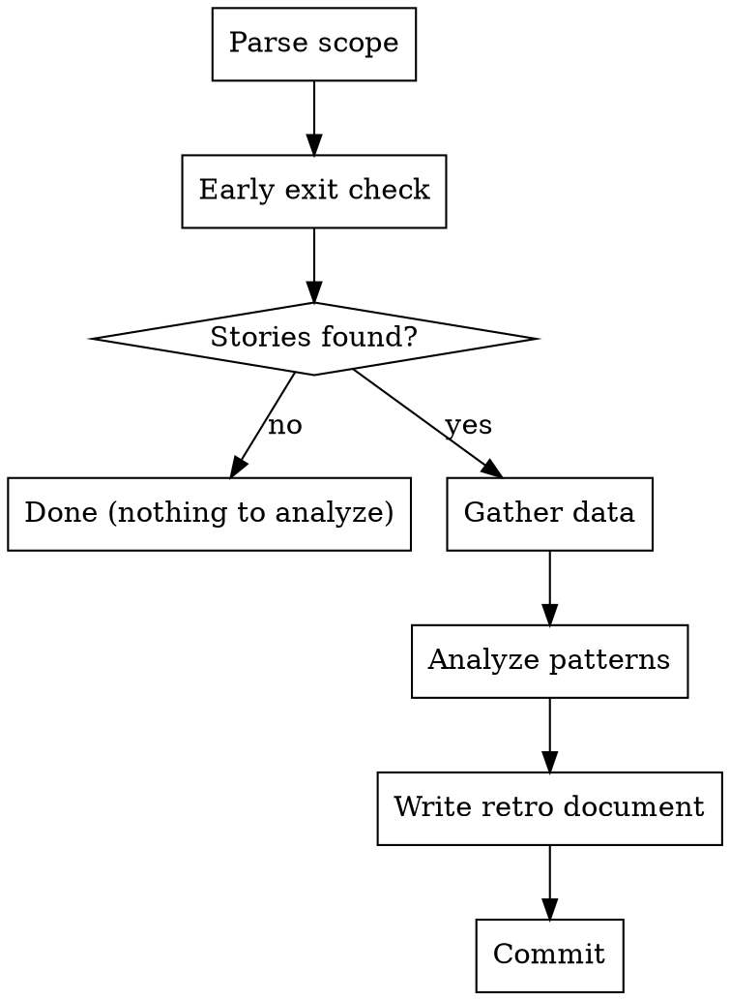
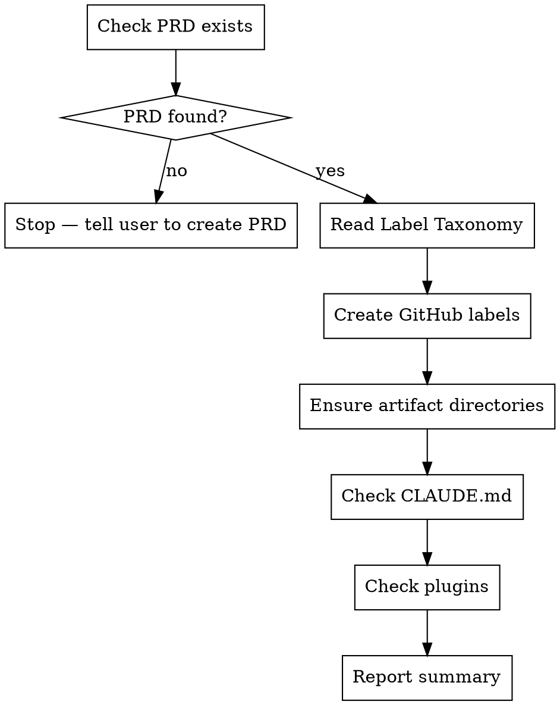

# SDLC v2 Fixes & Patterns Implementation Plan

> **For agentic workers:** REQUIRED SUB-SKILL: Use superpowers:subagent-driven-development (recommended) or superpowers:executing-plans to implement this plan task-by-task. Steps use checkbox (`- [ ]`) syntax for tracking.

**Goal:** Fix bugs, align templates, add superpowers patterns (iron laws, hard gates, flow diagrams), make area labels dynamic, and create the sdlc:init skill.

**Architecture:** Two commits on the existing `chore/sdlc-skill-suite` branch. Phase 1 (Tasks 1-6) fixes bugs and template consistency. Phase 2 (Tasks 7-11) adds superpowers patterns, dynamic area labels, and the init skill.

**Tech Stack:** Markdown skill files, `gh` CLI commands, Graphviz dot diagrams.

---

## File Structure

### Phase 1 — Bug Fixes + Template Consistency
| Action | File | Responsibility |
|--------|------|---------------|
| Modify | `docs/SDLC-GUIDE.md` | Fix retro description, status description, label taxonomy, add bootstrap + $ARGUMENTS sections |
| Modify | `.claude/plugins/sdlc/skills/capture/SKILL.md` | Smart title/body derivation |
| Modify | `.claude/plugins/sdlc/skills/retro/SKILL.md` | Fix read-only claim, add commit step, remove audit-ref, fix search quoting |
| Modify | `.claude/plugins/sdlc/skills/define/SKILL.md` | Fix reshape detection, remove feature grouping, add canonical dep format |
| Modify | `.claude/plugins/sdlc/skills/define/reference/prd-guide.md` | Add status:draft to template |
| Modify | `.claude/plugins/sdlc/skills/create/reference/epic-execution.md` | Remove duplicate block, complete stubs |
| Modify | `.claude/plugins/sdlc/skills/create/reference/prd-execution.md` | Fix reshape to surgical edits |
| Modify | `.claude/plugins/sdlc/skills/create/reference/feature-execution.md` | Complete story stubs |
| Modify | `.claude/plugins/sdlc/skills/update/SKILL.md` | Fix dependency escalation wording |
| Modify | `.claude/plugins/sdlc/skills/update/reference/epic-update.md` | Remove dead Parent section |
| Modify | `.claude/plugins/sdlc/skills/reconcile/SKILL.md` | Fix dash prefix examples, flat-epic handling |
| Modify | `CLAUDE.md` | Remove SDLC spec reference |

### Phase 2 — Superpowers Patterns + Init
| Action | File | Responsibility |
|--------|------|---------------|
| Modify | `.claude/plugins/sdlc/skills/define/SKILL.md` | Iron law, hard gate, flow diagram, remove hardcoded area taxonomy |
| Modify | `.claude/plugins/sdlc/skills/create/SKILL.md` | Iron law, hard gate, flow diagram |
| Modify | `.claude/plugins/sdlc/skills/update/SKILL.md` | Iron law, hard gate, flow diagram |
| Modify | `.claude/plugins/sdlc/skills/capture/SKILL.md` | Iron law, hard gate, flow diagram |
| Modify | `.claude/plugins/sdlc/skills/status/SKILL.md` | Iron law, hard gate, flow diagram, dynamic area labels |
| Modify | `.claude/plugins/sdlc/skills/reconcile/SKILL.md` | Iron law, hard gate, flow diagram, dynamic area labels |
| Modify | `.claude/plugins/sdlc/skills/retro/SKILL.md` | Iron law, hard gate, flow diagram |
| Modify | `.claude/plugins/sdlc/skills/define/reference/prd-guide.md` | Add Label Taxonomy section |
| Modify | `.claude/plugins/sdlc/skills/define/reference/epic-guide.md` | Dynamic area question |
| Modify | `.claude/plugins/sdlc/skills/update/reference/prd-update.md` | Area label cascade check |
| Create | `.claude/plugins/sdlc/skills/init/SKILL.md` | New bootstrap skill |

---

## Phase 1: Bug Fixes + Template Consistency

### Task 1: SDLC-GUIDE.md Fixes

**Files:**
- Modify: `docs/SDLC-GUIDE.md`

**Spec refs:** 1.1a, 1.1b, 1.1c, 1.1d, 1.1e

- [ ] **Step 1: Fix Phase 5 retro/archive description (1.1a)**

Replace lines 113-121 (the bullet list under "This skill:") with:

```markdown
**Step 1 — Run the retrospective:**
```
sdlc:retro pi
```
Produces an analysis document at `.claude/sdlc/retros/` covering what shipped, what carried over, process metrics, and recommendations. Does NOT modify issues, labels, or artifacts.

**Step 2 — Archive and start fresh:**
```
sdlc:create pi
```
When run with an existing PI, this skill:
- Bakes decision log entries into the relevant PRD sections
- Wipes the decision log for the next sprint
- Bumps the PRD version
- Archives the PI Plan to `.claude/sdlc/pi/completed/PI-N.md`
- Creates a git tag `pi-N-complete`
```

- [ ] **Step 2: Fix Phase 3 status description (1.1b)**

Replace lines 80-81:
```
Finds the highest-priority unblocked story (optionally filtered by area). Checks all dependencies, fixes any mismatched labels, presents a recommendation. On confirmation, marks it `status:in-progress` and you start coding.
```
With:
```
Presents an ordered list of unblocked stories by priority (optionally filtered by area). Checks all dependencies, traces root blockers, identifies parallelization opportunities. You decide which story to pick up — the `status:in-progress` label transition is your responsibility.
```

- [ ] **Step 3: Fix label taxonomy (1.1c)**

In the Label Taxonomy table (line 154):
- Add `triage` as a new row: `| Triage | \`triage\` |`
- Change `area:agents` to `area:agent` on line 157

- [ ] **Step 4: Fix Quick Reference table (1.1c)**

In the Quick Reference table (line 138), change:
```
| `sdlc:retro pi` | Archive current PI, bake decisions, tag |
```
To:
```
| `sdlc:retro pi` | Process retrospective with metrics |
```

- [ ] **Step 5: Add Bootstrap section (1.1d)**

After the "Plugin Loading" section (after line 207), add a new section:

```markdown
---

## Getting Started (First-Time Setup)

Before using the SDLC skills on a new project, set up the required GitHub labels. Universal labels (type, status, priority, triage) are the same for every project. Project-specific area labels are created by `sdlc:init` after the PRD exists.

### Universal labels

```bash
# Type labels
gh label create "type:epic" --color "0075ca" --force
gh label create "type:feature" --color "0075ca" --force
gh label create "type:story" --color "0075ca" --force

# Status labels
gh label create "status:todo" --color "0e8a16" --force
gh label create "status:in-progress" --color "0e8a16" --force
gh label create "status:done" --color "0e8a16" --force
gh label create "status:blocked" --color "0e8a16" --force

# Priority labels
gh label create "priority:critical" --color "d93f0b" --force
gh label create "priority:high" --color "d93f0b" --force
gh label create "priority:medium" --color "d93f0b" --force
gh label create "priority:low" --color "d93f0b" --force

# Triage
gh label create "triage" --color "fbca04" --force
```

### Project-specific area labels

After creating your PRD (`sdlc:define prd` → `sdlc:create prd`), run:

```
sdlc:init
```

This reads the PRD's Label Taxonomy section and creates the area labels for your project.
```

- [ ] **Step 6: Add $ARGUMENTS note (1.1e)**

After the "Getting Started" section, add:

```markdown
---

## Skill Arguments

Skills accept arguments after the command name. The placeholder `$ARGUMENTS` in skill files refers to this text, which the LLM substitutes before execution.

Example: `/sdlc:capture fix the login timeout bug` → `$ARGUMENTS` = `"fix the login timeout bug"`

Each skill's `argument-hint` in its frontmatter shows the expected format.
```

- [ ] **Step 7: Commit**

```bash
git add docs/SDLC-GUIDE.md
git commit -m "docs(sdlc): fix SDLC-GUIDE descriptions, taxonomy, and add bootstrap section"
```

---

### Task 2: Capture, Retro, and CLAUDE.md Fixes

**Files:**
- Modify: `.claude/plugins/sdlc/skills/capture/SKILL.md`
- Modify: `.claude/plugins/sdlc/skills/retro/SKILL.md`
- Modify: `CLAUDE.md`

**Spec refs:** 1.2, 1.3a-d, 1.10

- [ ] **Step 1: Rewrite capture skill (1.2)**

Replace the entire content of `.claude/plugins/sdlc/skills/capture/SKILL.md` with:

```markdown
---
name: capture
description: Use when you want to quickly capture an idea or task without going through the full sdlc:define ceremony. Creates a minimal GitHub issue with a triage label.
allowed-tools: Bash
argument-hint: "<description of the idea>"
---

I'm using the sdlc:capture skill to quickly capture this idea.

This is a no-ceremony skill — no context loading, no upstream artifact reading, no brainstorming phases. Just create the issue and report back.

### Instructions

1. Read the description from `$ARGUMENTS`.
2. Derive a **concise issue title** (under 80 characters) that captures the essence of the idea.
3. Structure the issue body with the full description.
4. Create the issue:

```bash
gh issue create \
  --title "<derived concise title>" \
  --label "triage" \
  --body "$(cat <<'EOF'
## Description
<full description from $ARGUMENTS>

## Status
Captured via sdlc:capture. Run `/sdlc:define` to flesh out when ready.
EOF
)"
```

Report the created issue number and URL to the user.

Note: `sdlc:reconcile` flags triage issues older than 14 days so nothing gets lost.
```

- [ ] **Step 2: Fix retro read-only claim (1.3a)**

In `.claude/plugins/sdlc/skills/retro/SKILL.md`, replace line 10:
```
This skill is **read-only** — it never modifies issues, labels, files, or any other state. Its sole purpose is retrospective analysis and document generation.
```
With:
```
This skill **does not modify issues, labels, or project artifacts**. It writes a retrospective document only.
```

- [ ] **Step 3: Add retro commit step (1.3b)**

In `retro/SKILL.md`, after Step 4 (writing the retro document, around line 378), before Step 5, add:

```markdown
### Step 4b: Commit the Retrospective Document

```bash
git add .claude/sdlc/retros/<filename>
git commit -m "docs(retro): add <scope> retrospective <date>"
```

Where `<scope>` is `pi-N`, `epic-N`, or `feature-N` and `<date>` is today's date.
```

Also update the Execution Checklist at the bottom to include between Step 4 and Step 5:
```
- [ ] Step 4b: Retrospective document committed to git
```

- [ ] **Step 4: Remove audit-ref from retro template (1.3c)**

In `retro/SKILL.md`, remove this line from the frontmatter in the retro document template (around line 316):
```
audit-ref: (placeholder for future sdlc:audit skill — see docs/sdlc-future-ideas.md)
```

Also remove the "Audit Reference" section at the bottom of the template (around lines 368-369):
```
## Audit Reference
(Consider running `sdlc:audit` for technical verification of code quality in this period — see docs/sdlc-future-ideas.md for the planned sdlc:audit skill)
```

- [ ] **Step 5: Fix retro search quoting (1.3d)**

In `retro/SKILL.md`, find all occurrences of:
```
--search "Epic: #N in:body"
```
and:
```
--search "Feature: #N in:body"
```

Replace with properly escaped versions:
```
--search '"Epic: #N" in:body'
```
and:
```
--search '"Feature: #N" in:body'
```

There are approximately 6 occurrences across the Early Exit Check (lines 54, 62) and Step 2a (lines 90-91, 98-99) and Step 3c (line 278). Fix all of them.

- [ ] **Step 6: Remove SDLC spec reference from CLAUDE.md (1.10)**

In `CLAUDE.md`, remove line 100:
```
- Design spec: `docs/superpowers/specs/2026-03-17-sdlc-skill-suite-design.md` — SDLC skill suite design
```

- [ ] **Step 7: Commit**

```bash
git add .claude/plugins/sdlc/skills/capture/SKILL.md .claude/plugins/sdlc/skills/retro/SKILL.md CLAUDE.md
git commit -m "fix(sdlc): rewrite capture skill, fix retro claims and commit step, clean CLAUDE.md"
```

---

### Task 3: Define Skill Fixes

**Files:**
- Modify: `.claude/plugins/sdlc/skills/define/SKILL.md`
- Modify: `.claude/plugins/sdlc/skills/define/reference/prd-guide.md`

**Spec refs:** 1.4a, 1.4b, 1.4c, 1.9

- [ ] **Step 1: Fix reshape detection (1.4a)**

In `define/SKILL.md`, replace lines 71-83 (the "Reshape if any of" section under Phase 0d) with:

```markdown
**Reshape** if any of:
- User provided an existing issue number in `$ARGUMENTS`
- User explicitly says "reshape", "rethink", "revise", or "update"

**Draft exists check:** Also scan for existing drafts at `.claude/sdlc/drafts/<level>-*.md`.
- If a draft exists AND the user provided an issue number that matches the draft filename → this is a reshape, load the draft.
- If a draft exists but no issue number was provided → ask before assuming:

> "I found a draft `<filename>`. Is this related to what you're defining now, or do you want to start fresh?"

If start fresh, proceed with new artifact flow (ignore the existing draft). If related, proceed with reshape flow.

If reshaping:
- Load the current state of the artifact (from GitHub issue body or git file)
- This becomes the starting context for all subsequent phases
- The draft produced in Phase 4 will include a `## Changes` section

If new:
- Proceed normally — no existing state to load
```

- [ ] **Step 2: Remove duplicate feature grouping section (1.4b)**

In `define/SKILL.md`, remove the entire "Feature Level: Optional Grouping" section (lines 301-313, from `## Feature Level: Optional Grouping` through the blank line before `## Integration`). This content already exists in `epic-guide.md` and is loaded during Phase 0.

- [ ] **Step 3: Add canonical dependency format (1.9)**

In `define/SKILL.md`, add the following section right before the `## Integration` section (which was previously after the feature grouping section you just removed):

```markdown
## Dependency Format (canonical)

All dependency references in issue bodies use this exact format:

```
- Blocked by: #N, #M
- Blocks: #N, #M
```

Rules:
- Always dash-prefixed (`- Blocked by:` not `Blocked by:`)
- Issue numbers use `#` prefix: `#48`, not `48`
- Multiple blockers separated by comma-space: `#48, #52`
- When no dependencies: `- Blocked by: none` and `- Blocks: none`
- Never use brackets, quotes, or other formatting around issue numbers

This is the canonical format that all define, create, update, and reconcile skills expect.

---
```

- [ ] **Step 4: Add status:draft to PRD template (1.4c)**

In `define/reference/prd-guide.md`, find the draft body template frontmatter (lines 85-89):
```yaml
---
name: <project name>
version: 1.0
created: <YYYY-MM-DD>
---
```

Replace with:
```yaml
---
name: <project name>
version: 1.0
created: <YYYY-MM-DD>
status: draft
---
```

- [ ] **Step 5: Commit**

```bash
git add .claude/plugins/sdlc/skills/define/SKILL.md .claude/plugins/sdlc/skills/define/reference/prd-guide.md
git commit -m "fix(sdlc): fix reshape detection, add canonical dep format, add status:draft to PRD template"
```

---

### Task 4: Create and Update Skill Fixes

**Files:**
- Modify: `.claude/plugins/sdlc/skills/create/reference/epic-execution.md`
- Modify: `.claude/plugins/sdlc/skills/create/reference/prd-execution.md`
- Modify: `.claude/plugins/sdlc/skills/update/SKILL.md`
- Modify: `.claude/plugins/sdlc/skills/update/reference/epic-update.md`

**Spec refs:** 1.5a, 1.5b, 1.6a, 1.6b

- [ ] **Step 1: Remove duplicate epic issue creation block (1.5a)**

In `create/reference/epic-execution.md`, remove the first command block (lines 27-37, the non-capturing `gh issue create` without variable assignment) and update the text to flow directly into the capturing block. The section should read:

```markdown
### 1. Create the Epic Issue

Write the draft body (without YAML frontmatter) to a temp file and create the issue:

```bash
# Strip frontmatter from draft, write body to temp file
# (everything after the closing --- of the frontmatter)

cat <<'BODY' > /tmp/sdlc-epic-body.md
<draft body content without frontmatter>
BODY

EPIC_URL=$(gh issue create \
  --title "<name>" \
  --body-file /tmp/sdlc-epic-body.md \
  --label "type:epic" \
  --label "priority:<priority>" \
  --label "area:<area1>" \
  --label "area:<area2>")
EPIC_NUM=$(echo "$EPIC_URL" | grep -o '[0-9]*$')
```
```

- [ ] **Step 2: Fix PRD reshape to surgical edits (1.5b)**

In `create/reference/prd-execution.md`, replace lines 49-57 (the "PRD Update (via reshape flow)" section steps 1-2) with:

```markdown
### PRD Update (via reshape flow)

When the draft has a `## Changes` section (produced by `sdlc:define` reshape), this is an update to an existing PRD.

1. **Read current PRD:**

```
Read .claude/sdlc/prd/PRD.md
```

2. **Apply changes surgically.** Read the `## Changes` table from the draft. For each row in the table, use the Edit tool to modify ONLY the targeted section in `.claude/sdlc/prd/PRD.md`. Do NOT replace the entire file with the draft content — the draft only contains changed sections, not the complete PRD.
```

- [ ] **Step 3: Add dependency escalation clarification (1.6a)**

In `update/SKILL.md`, find the section in Step 4 Path A that discusses dependency field changes (around line 167). Add the following clarification:

```markdown
**Note:** Dependency changes under direct update are limited to correcting an existing reference (e.g., fixing a wrong issue number). Adding a NEW dependency relationship (a new `Blocked by` or `Blocks` entry that wasn't there before) always escalates to define per Step 3.
```

- [ ] **Step 4: Remove dead Parent section from epic-update (1.6b)**

In `update/reference/epic-update.md`, remove `- \`## Parent\` — PI reference` from the common sections list (line 44).

- [ ] **Step 5: Commit**

```bash
git add .claude/plugins/sdlc/skills/create/reference/epic-execution.md .claude/plugins/sdlc/skills/create/reference/prd-execution.md .claude/plugins/sdlc/skills/update/SKILL.md .claude/plugins/sdlc/skills/update/reference/epic-update.md
git commit -m "fix(sdlc): remove duplicate epic creation, fix PRD reshape, clarify update escalation"
```

---

### Task 5: Reconcile Skill Fixes

**Files:**
- Modify: `.claude/plugins/sdlc/skills/reconcile/SKILL.md`

**Spec refs:** 1.7a, 1.7b, 1.7c

- [ ] **Step 1: Fix parent extraction example (1.7a)**

In `reconcile/SKILL.md`, find the parent extraction example (around lines 57-59):
```
## Parent
Feature: #42
```

Replace with:
```
## Parent
- Feature: #42
```

- [ ] **Step 2: Fix dependency extraction examples (1.7b)**

In `reconcile/SKILL.md`, find the dependency extraction patterns (around lines 63-64):
```
- Lines matching `Blocked by: #N` or `Blocked by: #N, #M`
- Lines matching `Blocks: #N` or `Blocks: #N, #M`
```

Replace with:
```
- Lines matching `- Blocked by: #N` or `- Blocked by: #N, #M` (dash-prefixed)
- Lines matching `- Blocks: #N` or `- Blocks: #N, #M` (dash-prefixed)
```

- [ ] **Step 3: Add flat-epic Feature:none handling (1.7c)**

In `reconcile/SKILL.md`, find the C2 check section (broken hierarchy). Add the following before the fix instructions:

```markdown
**Exception:** If a story's `## Parent` section contains `- Feature: none` or `- Feature: none (flat epic)`, this is valid — the story is a direct child of the epic with no feature grouping. Do NOT flag this as a broken hierarchy. Only check that the `- Epic: #N` reference is valid.
```

- [ ] **Step 4: Commit**

```bash
git add .claude/plugins/sdlc/skills/reconcile/SKILL.md
git commit -m "fix(sdlc): fix reconcile examples and add flat-epic handling"
```

---

### Task 6: Template Consistency — Stub Completeness + Phase 1 Commit

**Files:**
- Modify: `.claude/plugins/sdlc/skills/create/reference/epic-execution.md`
- Modify: `.claude/plugins/sdlc/skills/create/reference/feature-execution.md`

**Spec refs:** 1.8a, 1.8b, 1.8c

- [ ] **Step 1: Add Non-goals to feature stubs in epic-execution (1.8a)**

In `create/reference/epic-execution.md`, find the feature stub body template (around lines 58-71). Add `## Non-goals` after the `## Stories` section:

```markdown
## Stories
- (to be defined via /sdlc:define feature)

## Non-goals
(to be defined)

## Dependencies
```

- [ ] **Step 2: Add File Scope and Technical Notes to story stubs in epic-execution (1.8b)**

In `create/reference/epic-execution.md`, find the story stub body template (around lines 84-98). Add the missing sections after `## Acceptance Criteria`:

```markdown
## Acceptance Criteria
- (to be defined via /sdlc:define story)

## File Scope
(to be defined)

## Technical Notes
(to be defined)

## Dependencies
```

- [ ] **Step 3: Add File Scope and Technical Notes to story stubs in feature-execution (1.8c)**

In `create/reference/feature-execution.md`, find the story stub body template (around lines 47-61). Add the missing sections after `## Acceptance Criteria`:

```markdown
## Acceptance Criteria
- (to be defined via /sdlc:define story)

## File Scope
(to be defined)

## Technical Notes
(to be defined)

## Dependencies
```

- [ ] **Step 4: Commit stubs**

```bash
git add .claude/plugins/sdlc/skills/create/reference/epic-execution.md .claude/plugins/sdlc/skills/create/reference/feature-execution.md
git commit -m "fix(sdlc): complete stub templates with all sections update references expect"
```

- [ ] **Step 5: Squash Phase 1 commits into one**

Squash all Phase 1 commits (Tasks 1-6) into a single commit:

```bash
git reset --soft HEAD~6
git commit -m "$(cat <<'EOF'
fix(sdlc): Phase 1 — bug fixes and template consistency

- Fix SDLC-GUIDE retro/archive split-brain, status description, label taxonomy
- Add bootstrap section and $ARGUMENTS documentation to SDLC-GUIDE
- Rewrite capture skill for smart title/body derivation
- Fix retro read-only claim, add commit step, remove audit-ref, fix search quoting
- Fix define reshape detection to ask instead of assume
- Remove duplicate feature grouping from define (already in epic-guide)
- Add canonical dependency format definition
- Add status:draft to PRD draft template
- Remove duplicate epic creation block in epic-execution
- Fix PRD reshape to use surgical edits instead of wholesale replacement
- Clarify dependency escalation wording in update skill
- Remove dead Parent section from epic-update
- Fix reconcile examples for dash prefix, add flat-epic handling
- Complete feature and story stubs with all sections update references expect
- Remove SDLC spec reference from CLAUDE.md

Refs #121

Co-Authored-By: Claude Opus 4.6 (1M context) <noreply@anthropic.com>
EOF
)"
```

---

## Phase 2: Superpowers Patterns + Init

### Task 7: Iron Laws and Hard Gates for All 7 Skills

**Files:**
- Modify: `.claude/plugins/sdlc/skills/define/SKILL.md`
- Modify: `.claude/plugins/sdlc/skills/create/SKILL.md`
- Modify: `.claude/plugins/sdlc/skills/update/SKILL.md`
- Modify: `.claude/plugins/sdlc/skills/capture/SKILL.md`
- Modify: `.claude/plugins/sdlc/skills/status/SKILL.md`
- Modify: `.claude/plugins/sdlc/skills/reconcile/SKILL.md`
- Modify: `.claude/plugins/sdlc/skills/retro/SKILL.md`

**Spec refs:** 2.1, 2.2

For each skill, add the Iron Law and Hard Gate block immediately after the "I'm using the sdlc:X skill" announcement line and before the first `---` separator.

- [ ] **Step 1: Add Iron Law and Hard Gate to define/SKILL.md**

After line 8 (`I'm using the sdlc:define skill to define/reshape an SDLC artifact.`), add:

```markdown

**NO DRAFT WITHOUT ALL FIVE PHASES**

<HARD-GATE>
Do NOT produce a draft without completing Context Loading, Scope Assessment, Discovery, Approaches, and Draft phases in order. Do NOT skip a phase because the artifact "seems simple."
</HARD-GATE>
```

- [ ] **Step 2: Add Iron Law and Hard Gate to create/SKILL.md**

After line 8 (`I'm using the sdlc:create skill to push the draft to its final destination.`), add:

```markdown

**NO CREATIVE DECISIONS — EXECUTE THE DRAFT**

<HARD-GATE>
Do NOT ask creative questions, brainstorm alternatives, or modify draft content. Your job is validation and execution. If the draft needs creative changes, escalate back to sdlc:define.
</HARD-GATE>
```

- [ ] **Step 3: Add Iron Law and Hard Gate to update/SKILL.md**

After line 8 (`I'm using the sdlc:update skill to update an existing SDLC artifact.`), add:

```markdown

**NO SILENT SCOPE CHANGES — DIRECT OR ESCALATE**

<HARD-GATE>
Do NOT make changes that cross the DIRECT UPDATE boundary without escalating to sdlc:define. Do NOT combine multiple independent changes into one update.
</HARD-GATE>
```

- [ ] **Step 4: Add Iron Law and Hard Gate to capture/SKILL.md**

After the announcement line (`I'm using the sdlc:capture skill to quickly capture this idea.`), add:

```markdown

**CAPTURE, DON'T DESIGN**

<HARD-GATE>
Do NOT ask clarifying questions, assess scope, or brainstorm. Create the issue and report back. If the idea needs fleshing out, tell the user to run sdlc:define.
</HARD-GATE>
```

- [ ] **Step 5: Add Iron Law and Hard Gate to status/SKILL.md**

After line 8 (`I'm using the sdlc:status skill to get a project briefing.`), add:

```markdown

**REPORT, DON'T ACT**

<HARD-GATE>
Do NOT modify issues, labels, files, or any state. Present the briefing and offer next actions. The user or another skill acts on your recommendations.
</HARD-GATE>
```

- [ ] **Step 6: Add Iron Law and Hard Gate to reconcile/SKILL.md**

After line 8 (`I'm using the sdlc:reconcile skill to audit the issue hierarchy.`), add:

```markdown

**FIX LABELS, NOTHING ELSE**

<HARD-GATE>
Do NOT modify issue bodies, titles, or content. Only touch labels and open/closed state. If a fix requires content changes, flag it for sdlc:update.
</HARD-GATE>
```

- [ ] **Step 7: Add Iron Law and Hard Gate to retro/SKILL.md**

After the announcement line (`I'm using the sdlc:retro skill to run a retrospective on [scope].`), add:

```markdown

**ANALYZE, DON'T JUDGE**

<HARD-GATE>
Do NOT modify issues, labels, or project artifacts. Write the retrospective document only. Let the data speak — present metrics and patterns, not prescriptive process changes.
</HARD-GATE>
```

- [ ] **Step 8: Commit**

```bash
git add .claude/plugins/sdlc/skills/*/SKILL.md
git commit -m "feat(sdlc): add iron laws and hard gates to all 7 skills"
```

---

### Task 8: Dot Flow Diagrams for All 7 Skills

**Files:**
- Modify: `.claude/plugins/sdlc/skills/define/SKILL.md`
- Modify: `.claude/plugins/sdlc/skills/create/SKILL.md`
- Modify: `.claude/plugins/sdlc/skills/update/SKILL.md`
- Modify: `.claude/plugins/sdlc/skills/capture/SKILL.md`
- Modify: `.claude/plugins/sdlc/skills/status/SKILL.md`
- Modify: `.claude/plugins/sdlc/skills/reconcile/SKILL.md`
- Modify: `.claude/plugins/sdlc/skills/retro/SKILL.md`

**Spec ref:** 2.3

For each skill, add the flow diagram after the `</HARD-GATE>` block and before the first section heading (e.g., `## Red Flags` or `## Step 1`). Declare diamond-shaped nodes separately for valid Graphviz syntax.

- [ ] **Step 1: Add flow diagram to define/SKILL.md**

After the `</HARD-GATE>` block, before `## Red Flags`, add:

````markdown

## Process Flow



---
````

- [ ] **Step 2: Add flow diagram to create/SKILL.md**

After the `</HARD-GATE>` block, before `## Red Flags`, add:

````markdown

## Process Flow



---
````

- [ ] **Step 3: Add flow diagram to update/SKILL.md**

After the `</HARD-GATE>` block, before `## Red Flags`, add:

````markdown

## Process Flow



---
````

- [ ] **Step 4: Add flow diagram to capture/SKILL.md**

After the `</HARD-GATE>` block, before `### Instructions`, add:

````markdown

## Process Flow


---
````

- [ ] **Step 5: Add flow diagram to status/SKILL.md**

After the `</HARD-GATE>` block, before `## Step 1`, add:

````markdown

## Process Flow



---
````

- [ ] **Step 6: Add flow diagram to reconcile/SKILL.md**

After the `</HARD-GATE>` block, before `## Step 1`, add:

````markdown

## Process Flow



---
````

- [ ] **Step 7: Add flow diagram to retro/SKILL.md**

After the `</HARD-GATE>` block, before `## Step 1`, add:

````markdown

## Process Flow



---
````

- [ ] **Step 8: Commit**

```bash
git add .claude/plugins/sdlc/skills/*/SKILL.md
git commit -m "feat(sdlc): add dot flow diagrams to all 7 skills"
```

---

### Task 9: Dynamic Area Labels

**Files:**
- Modify: `.claude/plugins/sdlc/skills/define/SKILL.md`
- Modify: `.claude/plugins/sdlc/skills/define/reference/epic-guide.md`
- Modify: `.claude/plugins/sdlc/skills/status/SKILL.md`
- Modify: `.claude/plugins/sdlc/skills/reconcile/SKILL.md`

**Spec ref:** 2.4

- [ ] **Step 1: Remove hardcoded area taxonomy from define/SKILL.md**

In `define/SKILL.md`, find line 234 (in the Draft Frontmatter section):
```
- `areas` uses the label taxonomy: `auth`, `api`, `agents`, `ui`, `infra`, `search`.
```

Replace with:
```
- `areas` uses the area labels defined in the PRD's Label Taxonomy section. If defining a PRD (no existing PRD to read from), the areas are part of what you're creating — derive them from codebase analysis or user description.
```

- [ ] **Step 2: Make epic-guide area question dynamic**

In `define/reference/epic-guide.md`, replace line 33:
```
6. **Area labels:** "Which areas does this touch? (auth, api, agents, ui, infra, search)"
```
With:
```
6. **Area labels:** "Which areas does this touch? (check the PRD's Label Taxonomy section at `.claude/sdlc/prd/PRD.md` for this project's valid areas)"
```

- [ ] **Step 3: Make status/SKILL.md area resolution dynamic**

In `status/SKILL.md`, replace the scope parsing table (lines 20-22):
```
| Area name (`auth`, `api`, `agent`, `ui`, `search`, `infra`) | Stories with `area:<arg>` label |
```
With:
```
| Area name | Stories with `area:<arg>` label. Read `.claude/sdlc/prd/PRD.md` Label Taxonomy section to discover valid area names. If no PRD exists, treat any argument as a raw `area:<arg>` filter. |
```

Also replace the unknown scope message (line 29):
```
If `$ARGUMENTS` is non-empty but does not match a known area or the pattern `epic #N`, announce: "Unknown scope `$ARGUMENTS`. Valid options: area name (`auth`, `api`, `agent`, `ui`, `search`, `infra`) or `epic #<number>`. Showing full PI instead." and proceed with no filter.
```
With:
```
If `$ARGUMENTS` is non-empty and does not match the pattern `epic #N`, treat it as an area name. Apply `--label "area:<arg>"` to all queries. If the filter returns no results, announce: "No stories found with label `area:<arg>`. Check the PRD's Label Taxonomy for valid areas, or run with no argument for full PI scope." and stop.
```

- [ ] **Step 4: Make reconcile/SKILL.md area resolution dynamic**

In `reconcile/SKILL.md`, replace the scope parsing table (lines 22-23):
```
| Area name (`auth`, `api`, `agent`, `ui`, `search`, `infra`) | Issues with `area:<arg>` label only |
```
With:
```
| Area name | Issues with `area:<arg>` label only. Read `.claude/sdlc/prd/PRD.md` Label Taxonomy section to discover valid area names. If no PRD exists, treat any argument as a raw `area:<arg>` filter. |
```

Also replace the unknown area message (line 29):
```
If `$ARGUMENTS` is non-empty but does not match a known area, announce: "Unknown area `$ARGUMENTS`. Valid areas: `auth`, `api`, `agent`, `ui`, `search`, `infra`. Scanning all areas instead." and proceed with no filter.
```
With:
```
If `$ARGUMENTS` is non-empty, treat it as an area name and apply `--label "area:<arg>"` to all queries. If the filter returns no results, announce: "No issues found with label `area:<arg>`. Check the PRD's Label Taxonomy for valid areas, or run with no argument to scan all." and proceed with no filter.
```

- [ ] **Step 5: Commit**

```bash
git add .claude/plugins/sdlc/skills/define/SKILL.md .claude/plugins/sdlc/skills/define/reference/epic-guide.md .claude/plugins/sdlc/skills/status/SKILL.md .claude/plugins/sdlc/skills/reconcile/SKILL.md
git commit -m "feat(sdlc): make area labels dynamic — read from PRD instead of hardcoded lists"
```

---

### Task 10: PRD Label Taxonomy Section + Update Cascade

**Files:**
- Modify: `.claude/plugins/sdlc/skills/define/reference/prd-guide.md`
- Modify: `.claude/plugins/sdlc/skills/update/reference/prd-update.md`

**Spec ref:** 2.5

- [ ] **Step 1: Add Label Taxonomy section to PRD template**

In `define/reference/prd-guide.md`, add the following section to the draft body template, after `## Out of Scope` and before `## Decision Log`:

```markdown
## Label Taxonomy

### Areas
| Label | Description |
|-------|-------------|
| area:<name> | <one-line description of what this area covers> |

(Derive areas from the project's architecture. For brownfield projects, analyze the codebase directory structure and module boundaries. For greenfield, ask the user about the major areas/modules of the project.)
```

- [ ] **Step 2: Add Label Taxonomy question to greenfield interview**

In `define/reference/prd-guide.md`, in the Greenfield Interview section (after question 10, around line 65), add:

```markdown
11. **Area labels:** "Based on the architecture, I'd propose these area labels for tracking work: [list derived from architecture answer]. Do these cover the major areas, or should we add/remove any?"
```

- [ ] **Step 3: Add area label cascade check to prd-update**

In `update/reference/prd-update.md`, at the end of the Cascade Rules section (after line 60), add:

```markdown
- **If the Architecture or Label Taxonomy section changed**: check whether area labels need to be updated. If areas were added, renamed, or removed from the Label Taxonomy, flag: "Area labels may have changed. Run `sdlc:init` to sync GitHub labels with the updated PRD."
```

- [ ] **Step 4: Commit**

```bash
git add .claude/plugins/sdlc/skills/define/reference/prd-guide.md .claude/plugins/sdlc/skills/update/reference/prd-update.md
git commit -m "feat(sdlc): add Label Taxonomy to PRD template and area cascade check"
```

---

### Task 11: Create sdlc:init Skill + Phase 2 Commit

**Files:**
- Create: `.claude/plugins/sdlc/skills/init/SKILL.md`

**Spec ref:** 2.6

- [ ] **Step 1: Create the init skill directory**

```bash
mkdir -p .claude/plugins/sdlc/skills/init
```

- [ ] **Step 2: Write the init skill**

Create `.claude/plugins/sdlc/skills/init/SKILL.md` with this content:

```markdown
---
name: init
description: Bootstrap SDLC infrastructure — creates GitHub labels, artifact directories, and checks project setup. Run after creating a PRD.
allowed-tools: Read, Bash, Grep, Glob
argument-hint: "(no arguments)"
---

I'm using the sdlc:init skill to bootstrap SDLC infrastructure for this project.

**BOOTSTRAP, DON'T BUILD**

<HARD-GATE>
Do NOT define artifacts, brainstorm, or create issues. Only set up infrastructure. If the PRD doesn't exist, tell the user to run sdlc:define prd first.
</HARD-GATE>

## Process Flow



---

## Step 1: Validate PRD Exists

```
Read .claude/sdlc/prd/PRD.md
```

If the file does not exist, report:

> "No PRD found at `.claude/sdlc/prd/PRD.md`. Run `sdlc:define prd` followed by `sdlc:create prd` first."

STOP. Do not proceed further.

---

## Step 2: Read Label Taxonomy

Parse the PRD for a `## Label Taxonomy` section. If found, extract the area label names from the table rows (each row has `| area:<name> | <description> |`).

If no Label Taxonomy section exists, announce:

> "PRD does not have a Label Taxonomy section. I'll create universal labels only. Consider running `sdlc:update prd` to add a Label Taxonomy section, then re-run `sdlc:init`."

Record: `AREA_LABELS` (list of area names, possibly empty).

---

## Step 3: Create GitHub Labels

Create all labels using `--force` for idempotency (creates if missing, updates color if exists).

```bash
# Type labels (blue)
gh label create "type:epic" --color "0075ca" --force
gh label create "type:feature" --color "0075ca" --force
gh label create "type:story" --color "0075ca" --force

# Status labels (green)
gh label create "status:todo" --color "0e8a16" --force
gh label create "status:in-progress" --color "0e8a16" --force
gh label create "status:done" --color "0e8a16" --force
gh label create "status:blocked" --color "0e8a16" --force

# Priority labels (red)
gh label create "priority:critical" --color "d93f0b" --force
gh label create "priority:high" --color "d93f0b" --force
gh label create "priority:medium" --color "d93f0b" --force
gh label create "priority:low" --color "d93f0b" --force

# Triage (yellow)
gh label create "triage" --color "fbca04" --force
```

Then for each area label from the PRD:

```bash
gh label create "area:<name>" --color "7057ff" --force
```

Track counts: how many labels were newly created vs already existed. The `--force` flag means existing labels are silently updated (color only), so count the total attempted.

---

## Step 4: Ensure Artifact Directories

```bash
mkdir -p .claude/sdlc/prd
mkdir -p .claude/sdlc/pi/completed
mkdir -p .claude/sdlc/drafts
mkdir -p .claude/sdlc/retros
```

Add `.gitkeep` files to any empty directories:

```bash
for dir in .claude/sdlc/prd .claude/sdlc/pi .claude/sdlc/pi/completed .claude/sdlc/drafts .claude/sdlc/retros; do
  if [ -z "$(ls -A $dir 2>/dev/null)" ]; then
    touch "$dir/.gitkeep"
  fi
done
```

---

## Step 5: Check CLAUDE.md

```bash
grep -l "sdlc:" CLAUDE.md 2>/dev/null || grep -l ".claude/sdlc/" CLAUDE.md 2>/dev/null
```

If neither pattern is found in CLAUDE.md, suggest:

> "Your CLAUDE.md doesn't reference the SDLC workflow yet. Consider running the `claude-md-management:claude-md-improver` skill to add SDLC conventions based on your PRD."

If found, report: "CLAUDE.md already references SDLC workflow."

---

## Step 6: Check Recommended Plugins

Check for key plugins. This is informational only — do not install anything.

Report which of the following are available:
- `superpowers` — workflow discipline (brainstorming, TDD, verification)
- `commit-commands` — conventional commit helpers

If any are missing, suggest: "Consider enabling [plugin] for [benefit]."

---

## Step 7: Report Summary

Present a summary:

```
## SDLC Init Complete

**Labels:**
- Universal: 12 labels (type, status, priority, triage)
- Project areas: N labels from PRD Label Taxonomy
- Total: N+12 labels ensured

**Directories:**
- .claude/sdlc/prd/ ✓
- .claude/sdlc/pi/ ✓
- .claude/sdlc/pi/completed/ ✓
- .claude/sdlc/drafts/ ✓
- .claude/sdlc/retros/ ✓

**CLAUDE.md:** [references SDLC | needs SDLC sections — see suggestion above]

**Plugins:** [all recommended present | missing: X — see suggestions above]

**Next step:** Run `sdlc:define pi` to plan your first increment.
```

---

## Execution Checklist

- [ ] Step 1: PRD existence verified
- [ ] Step 2: Label Taxonomy read (or noted as missing)
- [ ] Step 3: All GitHub labels created
- [ ] Step 4: Artifact directories confirmed
- [ ] Step 5: CLAUDE.md checked
- [ ] Step 6: Plugins checked
- [ ] Step 7: Summary reported
```

- [ ] **Step 3: Commit init skill**

```bash
git add .claude/plugins/sdlc/skills/init/SKILL.md
git commit -m "feat(sdlc): add sdlc:init skill for project bootstrapping"
```

- [ ] **Step 4: Update SDLC-GUIDE Quick Reference with init skill**

In `docs/SDLC-GUIDE.md`, add `sdlc:init` to the Quick Reference table after the `sdlc:capture` row:

```markdown
| `sdlc:init` | Bootstrap labels, directories, and project setup |
```

Also update the "Starting a brand new project" workflow to include init:

After `sdlc:create prd` line, add:
```
sdlc:init               → creates GitHub labels from PRD
```

```bash
git add docs/SDLC-GUIDE.md
git commit -m "docs(sdlc): add sdlc:init to SDLC-GUIDE quick reference and workflows"
```

- [ ] **Step 5: Squash Phase 2 commits into one**

Squash all Phase 2 commits (Tasks 7-11) into a single commit:

```bash
git reset --soft HEAD~6
git commit -m "$(cat <<'EOF'
feat(sdlc): Phase 2 — superpowers patterns, dynamic areas, and sdlc:init

- Add iron laws and hard gates to all 7 skills
- Add Graphviz dot flow diagrams to all 7 skills
- Make area labels dynamic — read from PRD Label Taxonomy instead of hardcoded
- Add Label Taxonomy section to PRD template
- Add area label cascade check to prd-update
- Create sdlc:init skill for project bootstrapping
- Update SDLC-GUIDE with init skill and workflows

Refs #121

Co-Authored-By: Claude Opus 4.6 (1M context) <noreply@anthropic.com>
EOF
)"
```

---

## Verification

After both phases are complete:

- [ ] All 8 SKILL.md files (7 original + init) have iron laws and hard gates
- [ ] All 8 SKILL.md files have dot flow diagrams
- [ ] No hardcoded area labels remain in any skill or reference file
- [ ] `sdlc:init` skill exists at `.claude/plugins/sdlc/skills/init/SKILL.md`
- [ ] SDLC-GUIDE has correct retro description, bootstrap section, init in quick reference
- [ ] Reconcile examples use dash prefix
- [ ] Feature and story stubs include all sections
- [ ] PRD template has status:draft and Label Taxonomy section
- [ ] Branch has exactly 2 commits (Phase 1 squash + Phase 2 squash)
