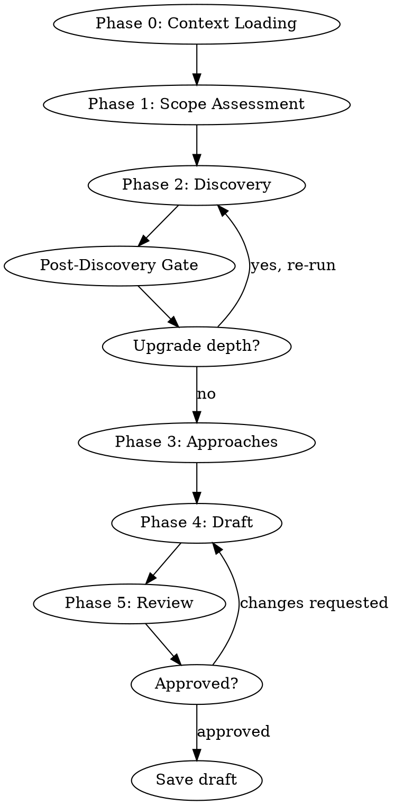
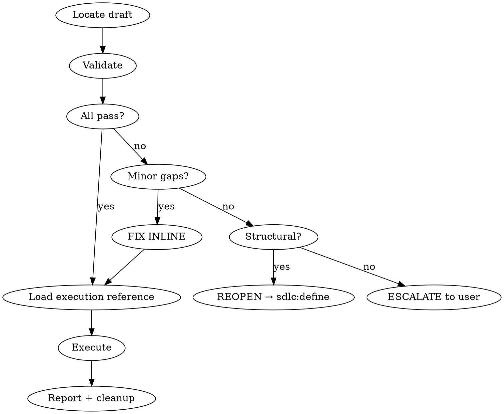
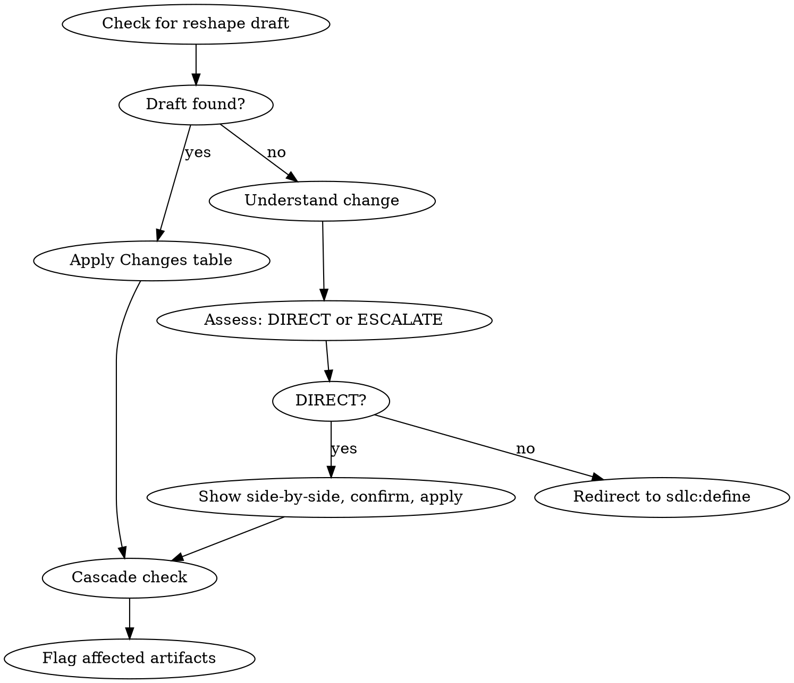
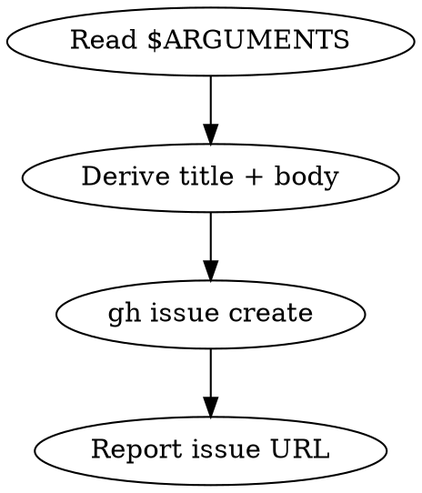
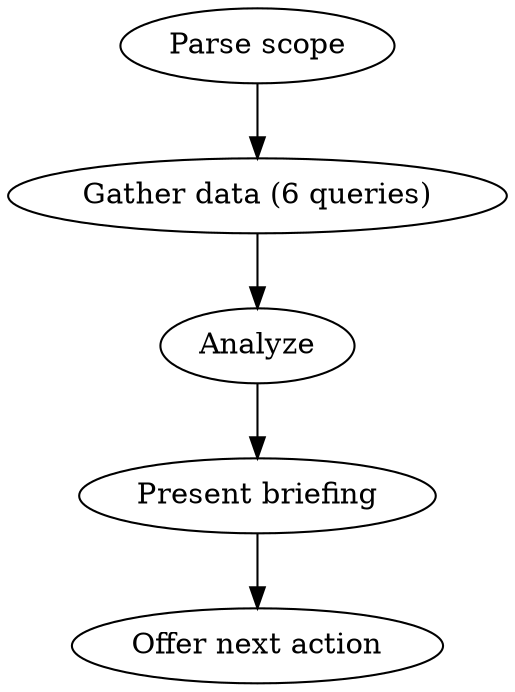
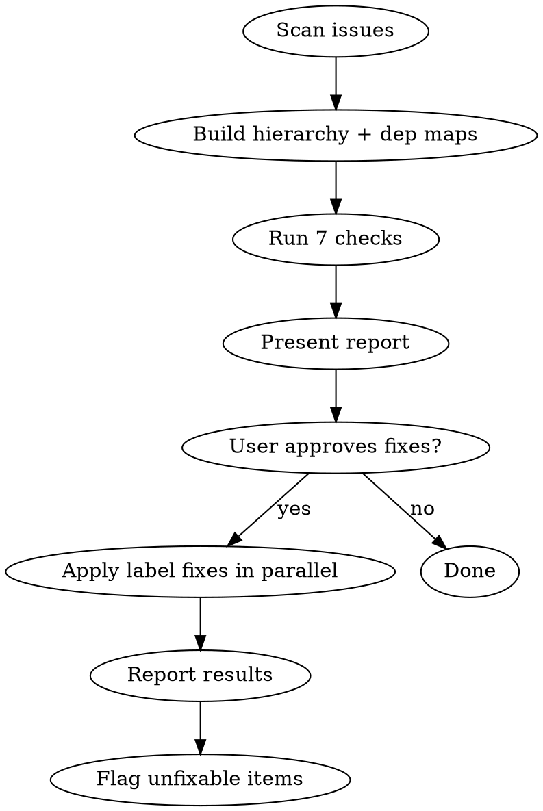
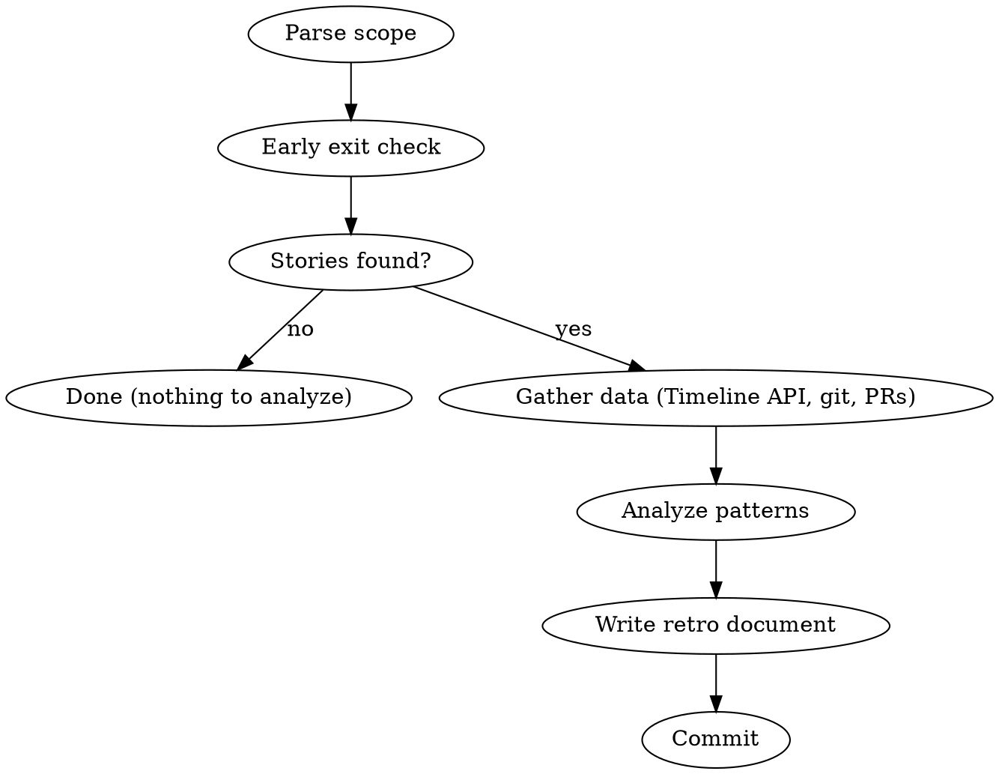
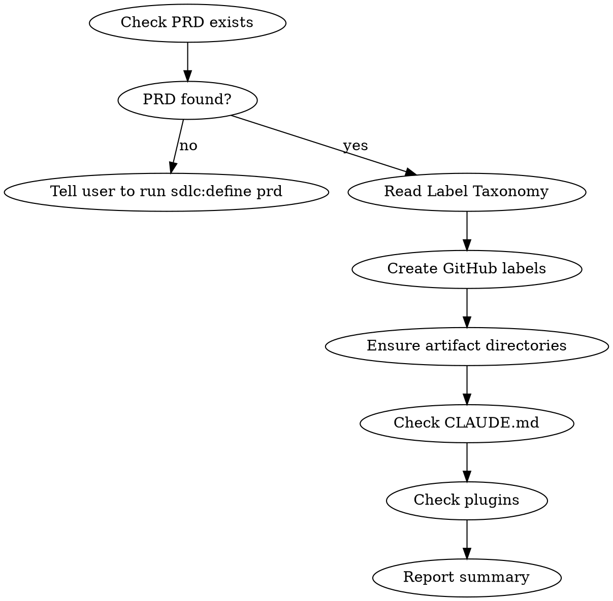

# SDLC v2 Plugin — Fixes, Template Consistency & Superpowers Pattern Alignment

## Context

The SDLC v2 plugin (7 skills, 15 reference files) was built on branch `chore/sdlc-skill-suite` per the design spec at `docs/superpowers/specs/2026-03-19-sdlc-v2-skill-suite-design.md`. A comprehensive three-agent review (code quality, spec compliance, superpowers comparison) identified bugs, template mismatches, and pattern gaps that need to be addressed before the plugin is production-ready.

This spec covers all fixes organized into two phases (two commits on the existing branch).

---

## Phase 1: Bug Fixes + Template Consistency

### 1.1 SDLC-GUIDE.md Fixes

**File:** `docs/SDLC-GUIDE.md`

**1.1a — Retro/archive split-brain:**
Phase 5 incorrectly describes `sdlc:retro` as performing PI archival (baking decision log entries, wiping the log, bumping PRD version, archiving PI, creating git tag). In reality, `sdlc:retro` only produces a retrospective document. The archival actions are performed by `sdlc:create pi`.

Fix: Rewrite Phase 5 to describe the two-step workflow:
- `sdlc:retro pi` — produces the analysis document
- `sdlc:create pi` — archives the PI, bakes decisions into PRD, creates git tag

**1.1b — Status description:**
Phase 3 claims `sdlc:status` "marks it `status:in-progress`". The status skill is read-only.

Fix: Replace with: "Presents an ordered list of unblocked stories by priority. You decide which to pick up."

**1.1c — Label taxonomy:**
- Add `triage` to the label taxonomy table
- Change `area:agents` to `area:agent` for consistency

**1.1d — Bootstrap section:**
Add a new "Getting Started" section with:
- A `gh label create` script for all universal labels (type:, status:, priority:, triage)
- A note that project-specific area labels are created by `sdlc:init` after the PRD exists

**1.1e — `$ARGUMENTS` contract:**
Add a brief note explaining that `$ARGUMENTS` is the text the user passes after the slash command, substituted by the LLM before execution. Example: `/sdlc:capture fix the login timeout bug` → `$ARGUMENTS` = `"fix the login timeout bug"`.

---

### 1.2 Capture Skill Rewrite

**File:** `.claude/plugins/sdlc/skills/capture/SKILL.md`

Current behavior: dumps raw `$ARGUMENTS` into both `--title` and `--body` of the `gh issue create` command. If the user provides a paragraph, the issue title is a paragraph.

Fix: Rewrite the skill to instruct the LLM to:
1. Read the description from `$ARGUMENTS`
2. Derive a concise issue title from the description
3. Structure the body with the full description under `## Description`
4. Run the `gh issue create` command with the derived title and structured body

Maintain the no-ceremony, fire-and-forget nature — no context loading, no brainstorming, no scope assessment.

---

### 1.3 Retro Skill Fixes

**File:** `.claude/plugins/sdlc/skills/retro/SKILL.md`

**1.3a — "Read-only" claim:**
The skill claims "This skill is read-only — it never modifies issues, labels, files, or any other state" but it writes a retro document to `.claude/sdlc/retros/`.

Fix: Replace with: "This skill does not modify issues, labels, or project artifacts. It writes a retrospective document only."

**1.3b — Missing commit step:**
Every other artifact-producing skill (PRD, PI) includes `git add` + `git commit`. Retro writes the document but has no commit step.

Fix: Add a commit step after writing the retro document:
```bash
git add .claude/sdlc/retros/<filename>
git commit -m "docs(retro): add <scope> retrospective <date>"
```

**1.3c — `audit-ref` placeholder:**
The retro document template includes an `audit-ref` frontmatter field with placeholder text that gets written into every generated retro document.

Fix: Remove the `audit-ref` field from the retro document template entirely.

**1.3d — Search quoting:**
The `--search "Epic: #N in:body"` pattern needs proper shell escaping.

Fix: Update to `--search '"Epic: #N" in:body'` with a note that this is a heuristic that may return false positives on large repositories.

---

### 1.4 Define Skill Fixes

**File:** `.claude/plugins/sdlc/skills/define/SKILL.md`

**1.4a — Reshape detection too broad:**
Phase 0d detects a reshape if any draft exists at `.claude/sdlc/drafts/<level>-*.md`. A stale draft from a different artifact could incorrectly trigger reshape mode.

Fix: When a same-level draft is found and the user didn't provide a matching issue number in `$ARGUMENTS`, ask instead of assuming:

> "I found a draft `<filename>`. Is this related to what you're defining now, or do you want to start fresh?"

If start fresh, proceed with new artifact flow. If related, proceed with reshape flow.

**1.4b — Remove duplicate feature grouping section:**
Lines 301-312 ("Feature Level: Optional Grouping") duplicate the same content in `epic-guide.md`. The define skill already loads `epic-guide.md` during Phase 0 when defining an epic.

Fix: Remove the "Feature Level: Optional Grouping" section (lines 301-312) entirely. The epic guide already covers this guidance and is loaded by the skill's own Phase 0 instructions.

**File:** `.claude/plugins/sdlc/skills/define/reference/prd-guide.md`

**1.4c — PRD draft template missing `status: draft`:**
`define/SKILL.md` Phase 4 says every draft MUST have `status: draft` in frontmatter, but the PRD template in `prd-guide.md` doesn't include it.

Fix: Add `status: draft` to the PRD draft body template frontmatter.

---

### 1.5 Create Skill Fixes

**File:** `.claude/plugins/sdlc/skills/create/reference/epic-execution.md`

**1.5a — Duplicate epic issue creation:**
Two separate `gh issue create` command blocks exist — one without variable capture, one with. An LLM following literally would create two epics.

Fix: Remove the first (non-capturing) command block. Keep only the single command that creates the issue. The URL is displayed by `gh issue create` automatically and by Claude Code natively.

**File:** `.claude/plugins/sdlc/skills/create/reference/prd-execution.md`

**1.5b — PRD reshape wholesale replacement:**
The reshape section says "write the draft content to `.claude/sdlc/prd/PRD.md`" which would replace the entire file. A reshape draft only contains the changed sections + a `## Changes` table.

Fix: Change to: "Apply the changes from the `## Changes` section to `.claude/sdlc/prd/PRD.md` using targeted edits — do NOT replace the entire file. Use the Edit tool to modify only the sections identified in the Changes table."

---

### 1.6 Update Skill Fixes

**File:** `.claude/plugins/sdlc/skills/update/SKILL.md`

**1.6a — Dependency escalation wording:**
Step 3 says "no new dependencies" is a DIRECT UPDATE condition, but Step 4 Path A includes dependency update instructions. This is ambiguous.

Fix: Add clarification to Step 4 Path A: "Dependency changes under direct update are limited to correcting an existing reference (e.g., fixing a wrong issue number). Adding a NEW dependency always escalates to define per Step 3."

**File:** `.claude/plugins/sdlc/skills/update/reference/epic-update.md`

**1.6b — Dead `## Parent` section:**
`epic-update.md` lists `## Parent — PI reference` as a recognized section, but no writer ever creates a `## Parent` section for epics.

Fix: Remove `## Parent` from epic-update.md's recognized sections list.

---

### 1.7 Reconcile Skill Fixes

**File:** `.claude/plugins/sdlc/skills/reconcile/SKILL.md`

**1.7a — Parent extraction example missing dash prefix:**
The example shows `Feature: #42` but all writers produce `- Feature: #42`.

Fix: Update the example to `- Feature: #42` with dash prefix.

**1.7b — Dependency example missing dash prefix:**
Same issue — examples show `Blocked by: #N` but writers produce `- Blocked by: #N`.

Fix: Update examples to include dash prefix.

**1.7c — Flat-epic `Feature: none` handling:**
The C2 hierarchy check has no explicit handling for `Feature: none (flat epic)` in a story's `## Parent` section. It could be flagged as a broken hierarchy.

Fix: Add to the C2 check: "If the `## Parent` section contains `Feature: none` or `Feature: none (flat epic)`, this is valid — the story is a direct child of the epic. Do NOT flag as a broken hierarchy."

---

### 1.8 Template Consistency — Stub Completeness

**File:** `.claude/plugins/sdlc/skills/create/reference/epic-execution.md`

**1.8a — Feature stubs missing `## Non-goals`:**
Feature stubs created during epic execution omit `## Non-goals`. The `feature-update.md` reference lists it as a recognized section.

Fix: Add `## Non-goals\n(to be defined)` to the feature stub body template.

**1.8b — Story stubs missing sections:**
Story stubs created during epic execution (flat) omit `## File Scope` and `## Technical Notes`.

Fix: Add both sections with `(to be defined)` placeholder to the story stub body template.

**File:** `.claude/plugins/sdlc/skills/create/reference/feature-execution.md`

**1.8c — Story stubs missing sections (feature path):**
Story stubs created during feature execution also omit `## File Scope` and `## Technical Notes`.

Fix: Same as 1.8b — add both sections with placeholder to the story stub body template.

---

### 1.9 Canonical Dependency Format

**File:** `.claude/plugins/sdlc/skills/define/SKILL.md`

Add a canonical dependency format definition, since all drafts originate from define:

```markdown
## Dependency Format (canonical)

All dependency references use this exact format in issue bodies:
- `- Blocked by: #N, #M` (dash prefix, `#` with number, comma-space separator)
- `- Blocks: #N, #M`
- `- Blocked by: none` (when no blockers)
- `- Blocks: none`

Never use brackets, quotes, or other formatting around issue numbers.
```

All reference guides (define, create, update) reference this as the standard rather than each defining their own format.

---

### 1.10 CLAUDE.md Fix

**File:** `CLAUDE.md`

Remove the reference to the SDLC skill suite design spec from the Reference Docs section. The spec is about the plugin, not the project. The plugin will eventually move to its own repository.

---

## Phase 2: Superpowers Pattern Alignment + sdlc:init

### 2.1 Iron Laws

Add a single-line Iron Law to the top of each SKILL.md, placed immediately after the "I'm using the sdlc:X skill" announcement line. Format: bold, all-caps, standalone line.

| Skill | Iron Law |
|-------|----------|
| `define` | `NO DRAFT WITHOUT ALL FIVE PHASES` |
| `create` | `NO CREATIVE DECISIONS — EXECUTE THE DRAFT` |
| `update` | `NO SILENT SCOPE CHANGES — DIRECT OR ESCALATE` |
| `capture` | `CAPTURE, DON'T DESIGN` |
| `status` | `REPORT, DON'T ACT` |
| `reconcile` | `FIX LABELS, NOTHING ELSE` |
| `retro` | `ANALYZE, DON'T JUDGE` |

---

### 2.2 Hard Gates

Add a `<HARD-GATE>` XML block to each SKILL.md, placed immediately after the Iron Law. Follows the superpowers pattern — explicit non-negotiable boundaries.

| Skill | Hard Gate Content |
|-------|-------------------|
| `define` | Do NOT produce a draft without completing Context Loading, Scope Assessment, Discovery, Approaches, and Draft phases in order. Do NOT skip a phase because the artifact "seems simple." |
| `create` | Do NOT ask creative questions, brainstorm alternatives, or modify draft content. Your job is validation and execution. If the draft needs creative changes, escalate back to sdlc:define. |
| `update` | Do NOT make changes that cross the DIRECT UPDATE boundary without escalating to sdlc:define. Do NOT combine multiple independent changes into one update. |
| `capture` | Do NOT ask clarifying questions, assess scope, or brainstorm. Create the issue and report back. If the idea needs fleshing out, tell the user to run sdlc:define. |
| `status` | Do NOT modify issues, labels, files, or any state. Present the briefing and offer next actions. The user or another skill acts on your recommendations. |
| `reconcile` | Do NOT modify issue bodies, titles, or content. Only touch labels and open/closed state. If a fix requires content changes, flag it for sdlc:update. |
| `retro` | Do NOT modify issues, labels, or project artifacts. Write the retrospective document only. Let the data speak — present metrics and patterns, not prescriptive process changes. |

---

### 2.3 Dot Flow Diagrams

Add a Graphviz `dot` diagram to each SKILL.md, placed after the Hard Gate block and before the detailed step instructions. Each diagram shows the skill's process flow with decision points.

**`define`** — the most complex diagram:


**`create`:**


**`update`:**


**`capture`:**


**`status`:**


**`reconcile`:**


**`retro`:**


Note: These are simplified overviews. The detailed step-by-step instructions remain as the authoritative guide — the diagrams are visual anchors, not replacements.

---

### 2.4 Dynamic Area Labels

Remove all hardcoded area label references and make them dynamic.

**File:** `.claude/plugins/sdlc/skills/define/SKILL.md`

Remove the hardcoded area taxonomy definition (currently at line 235). No replacement needed — area knowledge lives in the reference guides and the PRD.

**File:** `.claude/plugins/sdlc/skills/define/reference/epic-guide.md`

Change the question at line 33 from:
```
"Which areas does this touch? (auth, api, agents, ui, infra, search)"
```
To:
```
"Which areas does this touch? (check the PRD's Label Taxonomy section for this project's areas)"
```

**File:** `.claude/plugins/sdlc/skills/status/SKILL.md`

Remove the hardcoded area allowlist (lines 21, 29). Replace with:
- Read `.claude/sdlc/prd/PRD.md` Label Taxonomy section to discover valid area names
- Any area argument matching a label in the taxonomy is used as a `--label "area:<arg>"` filter
- If the PRD has no Label Taxonomy section, treat any non-empty argument as a raw area filter and let GitHub return results

**File:** `.claude/plugins/sdlc/skills/reconcile/SKILL.md`

Same approach as status — remove hardcoded area allowlist (lines 23, 29), read from PRD, fall back to passthrough.

---

### 2.5 PRD Label Taxonomy Section

**File:** `.claude/plugins/sdlc/skills/define/reference/prd-guide.md`

Add a `## Label Taxonomy` section to the PRD draft template. During the discovery phase, one of the questions asks about the project's major areas/modules. The LLM proposes areas based on codebase analysis (brownfield) or user description (greenfield).

Template section:
```markdown
## Label Taxonomy

### Areas
| Label | Description |
|-------|-------------|
| area:<name> | <one-line description> |
```

This is part of the PRD definition flow — the LLM creates this section, it doesn't read it from an existing source. For brownfield projects, the LLM analyzes the codebase structure to propose areas. For greenfield, it asks the user.

**File:** `.claude/plugins/sdlc/skills/update/reference/prd-update.md`

Add area label re-evaluation as a cascade check:
- When a PRD update changes the Architecture section or adds/removes modules, check whether the Label Taxonomy section needs corresponding updates
- If area labels change, flag: "Area labels may have changed — run `sdlc:init` to sync GitHub labels."

---

### 2.6 New Skill: sdlc:init

**Location:** `.claude/plugins/sdlc/skills/init/SKILL.md`

**Purpose:** Bootstrap the SDLC system for a project after the PRD exists. Idempotent — safe to run multiple times.

**Frontmatter:**
```yaml
---
name: init
description: Bootstrap SDLC infrastructure — creates GitHub labels, artifact directories, and checks project setup. Run after creating a PRD.
allowed-tools: Read, Bash, Grep, Glob
---
```

**Iron Law:** `BOOTSTRAP, DON'T BUILD`

**Hard Gate:** Do NOT define artifacts, brainstorm, or create issues. Only set up infrastructure. If the PRD doesn't exist, tell the user to run `sdlc:define prd` first.

**Flow diagram:**


**Steps:**

1. **Validate PRD exists** at `.claude/sdlc/prd/PRD.md`. If not found, report: "No PRD found. Run `sdlc:define prd` followed by `sdlc:create prd` first." Stop.

2. **Read the Label Taxonomy** from the PRD. Extract area label names and descriptions.

3. **Create GitHub labels** — idempotent via `gh label create --force`:
   - Universal type labels: `type:epic`, `type:feature`, `type:story`
   - Universal status labels: `status:todo`, `status:in-progress`, `status:done`, `status:blocked`
   - Universal priority labels: `priority:critical`, `priority:high`, `priority:medium`, `priority:low`
   - Triage label: `triage`
   - Project-specific area labels from PRD: `area:<name>` for each entry in Label Taxonomy
   - For each label, use a consistent color scheme (type = blue, status = green, priority = red, area = purple, triage = yellow)

4. **Ensure artifact directories** exist with `.gitkeep` files:
   - `.claude/sdlc/prd/`
   - `.claude/sdlc/pi/`
   - `.claude/sdlc/pi/completed/`
   - `.claude/sdlc/drafts/`
   - `.claude/sdlc/retros/`

5. **Check CLAUDE.md** — if it doesn't contain SDLC workflow references (search for `sdlc:` or `.claude/sdlc/`), suggest: "Your CLAUDE.md doesn't reference the SDLC workflow yet. Consider running the `claude-md-management:claude-md-improver` skill to add SDLC conventions based on your PRD."

6. **Check for recommended plugins** — check which of the following are available and report missing ones as recommendations (not requirements):
   - `superpowers` — workflow discipline
   - `commit-commands` — conventional commits
   - Informational only — do not install or configure anything.

7. **Report summary:**
   - Labels created: N new, M already existed
   - Directories: confirmed/created
   - CLAUDE.md: status
   - Plugins: status
   - Next step suggestion: "Run `sdlc:define pi` to plan your first increment."

---

## Files Modified (Summary)

### Phase 1
| File | Changes |
|------|---------|
| `docs/SDLC-GUIDE.md` | 1.1a-e: retro/archive description, status description, label taxonomy, bootstrap section, $ARGUMENTS note |
| `.claude/plugins/sdlc/skills/capture/SKILL.md` | 1.2: rewrite for smart title/body derivation |
| `.claude/plugins/sdlc/skills/retro/SKILL.md` | 1.3a-d: read-only claim, commit step, audit-ref removal, search quoting |
| `.claude/plugins/sdlc/skills/define/SKILL.md` | 1.4a-b, 1.9: reshape detection, remove feature grouping, add canonical dependency format |
| `.claude/plugins/sdlc/skills/define/reference/prd-guide.md` | 1.4c: add status:draft to template |
| `.claude/plugins/sdlc/skills/create/reference/epic-execution.md` | 1.5a, 1.8a-b: remove duplicate block, complete feature/story stubs |
| `.claude/plugins/sdlc/skills/create/reference/prd-execution.md` | 1.5b: surgical reshape edits |
| `.claude/plugins/sdlc/skills/create/reference/feature-execution.md` | 1.8c: complete story stubs |
| `.claude/plugins/sdlc/skills/update/SKILL.md` | 1.6a: dependency escalation wording |
| `.claude/plugins/sdlc/skills/update/reference/epic-update.md` | 1.6b: remove dead Parent section |
| `.claude/plugins/sdlc/skills/reconcile/SKILL.md` | 1.7a-c: dash prefix examples, flat-epic handling |
| `CLAUDE.md` | 1.10: remove SDLC spec reference |

### Phase 2
| File | Changes |
|------|---------|
| `.claude/plugins/sdlc/skills/define/SKILL.md` | 2.1-2.3, 2.4: iron law, hard gate, flow diagram, remove hardcoded area taxonomy |
| `.claude/plugins/sdlc/skills/create/SKILL.md` | 2.1-2.3: iron law, hard gate, flow diagram |
| `.claude/plugins/sdlc/skills/update/SKILL.md` | 2.1-2.3: iron law, hard gate, flow diagram |
| `.claude/plugins/sdlc/skills/capture/SKILL.md` | 2.1-2.3: iron law, hard gate, flow diagram |
| `.claude/plugins/sdlc/skills/status/SKILL.md` | 2.1-2.3, 2.4: iron law, hard gate, flow diagram, dynamic area labels |
| `.claude/plugins/sdlc/skills/reconcile/SKILL.md` | 2.1-2.3, 2.4: iron law, hard gate, flow diagram, dynamic area labels |
| `.claude/plugins/sdlc/skills/retro/SKILL.md` | 2.1-2.3: iron law, hard gate, flow diagram |
| `.claude/plugins/sdlc/skills/define/reference/prd-guide.md` | 2.5: add Label Taxonomy section to template |
| `.claude/plugins/sdlc/skills/define/reference/epic-guide.md` | 2.4: dynamic area question |
| `.claude/plugins/sdlc/skills/update/reference/prd-update.md` | 2.5: area label cascade check |
| `.claude/plugins/sdlc/skills/init/SKILL.md` | 2.6: new skill (create) |

---

## Out of Scope

- **SDLC agents** (story-context-loader, sdlc-code-reviewer, label-drift-watcher) — future phase, research documented separately
- **`.claude/rules/` integration** — bigger update, deferred
- **Updating existing artifacts** (PRD, PI) to add Label Taxonomy — will be done by dogfooding the skills after this fix pass
- **sdlc:audit skill** — future enhancement per `docs/sdlc-future-ideas.md`
- **Subagent prompt templates** — not needed; Claude Code's native exploration is sufficient, retro metrics are work-in-progress

---

## Decision Log

| Date | Decision | Rationale | Affects |
|------|----------|-----------|---------|
| 2026-03-20 | Retro stays analytical, create pi owns archival | Original design intent; retro is read-only except for the document it produces | retro, create, SDLC-GUIDE |
| 2026-03-20 | Capture derives title/body from description | User may provide a long description; skill should be smart about title vs body | capture |
| 2026-03-20 | `area:agent` (singular) is canonical | Matches CLAUDE.md conventional commit scopes | all skills, SDLC-GUIDE |
| 2026-03-20 | Phase 2 removes hardcoded areas, so Phase 1 skips the singular/plural fix in define | Avoids a change that gets replaced in the next commit | define |
| 2026-03-20 | Feature grouping removed from define/SKILL.md entirely (no cross-reference) | Epic guide already loaded by Phase 0; duplication is unnecessary | define |
| 2026-03-20 | No subagent prompt templates | Claude Code's native exploration is sufficient; retro metrics are WIP | define, retro |
| 2026-03-20 | sdlc:init runs after PRD exists, is idempotent | PRD provides area labels; init is the single bootstrap entry point | init, prd-guide |
| 2026-03-20 | PRD gets a Label Taxonomy section | Areas are project-specific; PRD is the source of truth | prd-guide, prd-update |
| 2026-03-20 | Dynamic area resolution reads from PRD, falls back to passthrough | Eliminates hardcoded area lists while supporting projects without a taxonomy section | status, reconcile, define, epic-guide |
| 2026-03-20 | Define skill doesn't need area instructions — reference guides handle it | PRD guide creates the taxonomy; epic/feature/story guides read from PRD | define |
| 2026-03-20 | Stubs include all sections that update references expect | Prevents update from targeting sections that don't exist on stub issues | epic-execution, feature-execution |
| 2026-03-20 | Reconcile handles `Feature: none (flat epic)` as valid | Flat-epic stories legitimately have no feature parent | reconcile |
| 2026-03-20 | Canonical dependency format defined once in define/SKILL.md | Single source of truth prevents reader/writer format drift | all skills |
| 2026-03-20 | CLAUDE.md removes SDLC spec reference | Plugin will move to its own repo; spec is about the plugin not the project | CLAUDE.md |
| 2026-03-20 | Two phases = two commits on existing branch | Phase 1 (fixes) and Phase 2 (enhancements) are cleanly separable | git history |
